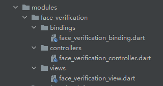
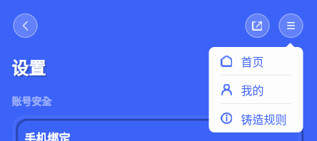

# Blockie

A Web3 sports life platform.

## Backend
* https://www.apifox.cn/web/project/1423402

## Docs
* https://ulv7gaxq0g.feishu.cn/docx/doxcnjVqcp8bOh5UFBZgFHFhvtc

## UI/UX

* https://share.lanhuapp.com/#/invite?sid=lX0l61Yy
* https://lanhuapp.com/url/arU2S-AV8aKt
* https://mastergo.com/file/72336366832516

## Sort Imports
```
$ flutter pub run import_sorter:main
```

## Generate Json Code
```
$ flutter pub run build_runner build
```

## How to generate module structure files

<details>

* Navigate to the root directory.
* Run `create_module.sh`.
```
$ sh create_module.sh <module_name> (eg: sh create_module.sh face_verification)
```
* It will automatically generate the directories and dart files.



</details>

## How to use `BasicAppBar`

<details>

### App Bar with Back Button


```dart
BasicAppBar()
```

### App Bar with Trailing Buttons


```dart
BasicAppBar(
    actionItems: [
        AppBarButtonItem(
            assetName: "assets/images/app_bar/share.png",
            onTap: () {},
        ),
        AppBarButtonItem(
            assetName: "assets/images/app_bar/menu.png",
            onTap: () {},
        ),
    ],
)
```

### App Bar with Trailing Flat Buttons without Back Button


```dart
BasicAppBar(
    showsBackButton: false,
    buttonStyle: AppBarButtonStyle.flat,
    actionItems: [
        AppBarButtonItem(
            assetName: "assets/images/app_bar/share.png",
            onTap: () {},
        ),
        AppBarButtonItem(
            assetName: "assets/images/app_bar/menu.png",
            onTap: () {},
        ),
    ],
)
```

### App Bar with Popup Menu Button



```dart
BasicAppBar(
    buttonStyle: AppBarButtonStyle.flat,
    actionItems: [
        AppBarButtonItem(
            assetName: "assets/images/app_bar/share.png",
            onTap: () {},
        ),
        AppBarButtonItem(
            assetName: "assets/images/app_bar/menu.png",
            items: [
                AppBarButtonItem(
                    title: '首页',
                    assetName: "assets/images/app_bar/home.png",
                    onTap: () {},
                ),
                AppBarButtonItem(
                    title: '我的',
                    assetName: "assets/images/app_bar/user.png",
                    onTap: () {},
                ),
                AppBarButtonItem(
                    title: '铸造规则',
                    assetName: "assets/images/app_bar/info.png",
                    onTap: () {},
                ),
            ],
        ),
    ],
)
```

</details>